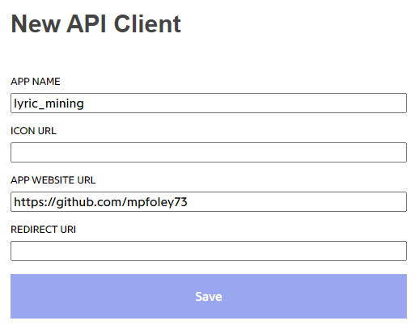
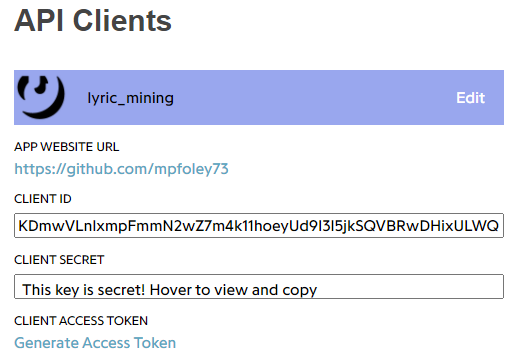

```{r setup, include=FALSE}
knitr::opts_chunk$set(echo = TRUE)
```

```{r include=FALSE}
pacman::p_load(tidyverse, geniusr, rvest, lubridate, httr, jsonlite, glue)
```

> Section 1 of my [Battle of the Bands](https://mpfoley73.github.io/battle-of-the-bands/) text mining project produces data frame objects containing song lyrics from three iconic rock bands: Queen, Rush, and AC/DC. It writes the data frames to files for processing in subsequent sections. One data frame contains one row per song; a second data frame contains one row per line of each song.

## Background

In order to analyze song lyrics, we need the song lyrics in some regular form. I searched Google for an easy way to compile song lyrics for all songs by an artist, preferably via an API. The best option I found was the website [Genius](https://genius.com/). Genius is a platform where users post lyrics and commentary (annotations) about artists and their songs. Genius offers an API ([documentation](https://docs.genius.com/)) through which you can pull song metadata, including the url to a web page with lyrics. Unfortunately, you cannot pull the lyrics directly from the API. For that you need to scrape each web page. There are at least three R packages (**genius**, **geniusr**, and **rgenius**) that use the API, but I did not have complete success with any of them. **genius** is no longer on CRAN and [its notes](https://github.com/JosiahParry/genius/issues/63) explain why: the Genius web site changes too frequently to build a reliable package.

Instead, I use none of the packages directly, but leverage their underlying code extensively to piece together my corpus of song lyrics. Some of this code may no longer work when you run it, but being bare-bones and not hidden behind function calls, hopefully you can tweak it to meet your purposes if/when the Genius API changes again. 

## The Genius API

You need to register your client with Genius in order to use their API. Registering identifies yourself, presumably so the API can warn or block you if you abuse it. I followed the [step-by-step guide](https://towardsdatascience.com/song-lyrics-genius-api-dcc2819c29) published by Ekene A. on **towards data science**. You should read the whole thing, but here are highlights.

**Step 1**: Go to https://genius.com/api-clients and click "New API Client". Genius asks for several items, but you only need to provide an app name and url. I wrote "lyric_mining" for APP NAME (I think you can put anything in here). I used my github account for APP WEBSITE URL. Click Save.



**Step 2**: After saving, Genius returned a page with my client ID, secret, and a link for the access token.



I dutifully saved this information for reference, but as far as I can tell there is nothing you need to do with either the client ID or secret - it's the CLIENT ACCESS TOKEN that you pass to the API to get results. 

**Step 3**: You should assign the access token string to a character variable in your program that you can pass to the API for each request. Better yet, since you probably don't want to hard-code your token for everyone to see in your R script, set the value in your project `.Renviron` file. In my RStudio console, I entered

```{r eval=FALSE}
# (not run)
Sys.setenv(GENIUS_API_TOKEN = "I pasted my access token text here")
```

Below I read my environment variable into a variable that I will use for the rest of this section.

```{r}
genius_api_token <- Sys.getenv("GENIUS_API_TOKEN")
```

## Identify Song URLs with Genius API

Now I will use the Genius API to construct a data frame of URLs for every Rush, Queen, and AC/DC song. The API only requires that I pass it the artist ID. My first task is to identify the artist IDs for the bands. 

### API Request for Artist ID

The function `geniusr::search_artist()` still works, so I could use it to get artist IDs, but I want to peak under its hood to learn how to interface with an API. `search_artist()` uses **httr** functions `GET()` and `content()` then sequences through the result set list. I experimented with this and discovered `jsonlite::fromJSON()` does the same thing more compactly.

Here is a search for "Rush". Notice how `search_url()` includes the `genius_api_token` I created in the prior step. 

```{r}
base_url <- "https://api.genius.com"

search_url <- glue("{base_url}/search?q=Rush&per_page=50&access_token={genius_api_token}")

search_result <- fromJSON(search_url, flatten = TRUE)

search_result$response$hits %>%
  select(result.primary_artist.id, result.primary_artist.name)
```

Aha! Rush is ID 4384.

```{r}
artist_ids <- vector()
artist_ids["rush"] <- 4384
```

I repeated the exercise for Queen and AC/DC. Queen is ID 563. AC/DC is ID 20268.

```{r}
artist_ids["queen"] <- 563
artist_ids["ac/dc"] <- 20268
```

### API Request for Song URLs

Now I am ready to search for the song URLs associated with the three artist IDs. Here I could use `geniusr::get_artist_songs_df()`, but I'll keep going the hard way. The code below is based on **geniusr**, again I'm using `fromJSON()` instead of `GET()` and `content()`.

Notice the `search_url` passed into the API requests songs from a _single_ artist ID, so I need to loop through my three IDs. I defined a function `search_artist()` that I call once for each of the three bands. The API returns *one page* of results per request, so you have to request each page individually. Inside `search_artist()` is a `while()` loop that requests pages until the current result's `next_page` field is finally `NA`. Within each result is a data frame (`search_result$response$songs`) which I tack onto a list object (`artist_songs_list`). When the function completes it returns `artist_song_list`. After calling the function three times and accumulating the lists in another list object (`songs_list`), I row-bind the three lists into a single data frame, `songs_0`.

```{r}
# Make a function to search one artist at a time. Returns a list of data frames.
search_artist <- function(artist_id) {
  # song_list will be a list of data frames, one data frame per search result page.
  artist_song_list <- list()
  # Assume at least 1 page of results (I know, not robust). My search returned 25
  # pages. The while loop exits when the `next_page` variable is null, but caps at
  # 100 pages just as a guard-rail.
  page_num <- 1
  while (page_num < 100) {
    search_url <- glue("{base_url}/artists/{artist_id}/songs?page={page_num}&access_token={genius_api_token}")
    search_result <- fromJSON(search_url, flatten = TRUE)
    artist_song_list[[page_num]] <- search_result$response$songs
    page_num <- search_result$response$next_page
    if (is.null(page_num)) {
      break
    }
  }
  artist_song_list
}

# This list accumulates the three lists created from calls to `search_artist()`.
songs_list <- list()

for(i in 1:length(artist_ids)) {
  songs_list[[i]] <- search_artist(artist_ids[i])
}

# From a list of lists of data frames, to a single data frame.
songs_0 <- bind_rows(songs_list) %>%
  select(
    artist_id = primary_artist.id, 
    song_id = id, 
    song = title_with_featured, 
    song_url = url
  ) %>%
  # Some results have a different primary artist than the three I requested
  filter(artist_id %in% artist_ids) %>% 
  # song id 307393 comes in twice. Enforce unique
  unique()

glimpse(songs_0)
```

So far, so good, except data frame `songs_0` has `r nrow(songs_0) %>% scales::comma()` rows. Scanning the results, I can see that is a lot more than what these bands actually composed. The problem is `songs_0` includes live albums, songs mis-attributed to the bands, and a few duplicates (same song, slightly different name). There are other songs I want to remove as well. I'll remove instrumentals (this is a lyrics analysis!). I'll remove songs from Rush's 1974 debut album because Neil Peart wasn't in the band yet (Rush - Peart != Rush). I'll remove Queen's Flash Gordon soundtrack since it is essentially instrumentals with overlaid movie dialogue. The code chunk below is the result of a tedious row-by-row examination of the results set, visiting the Genius site with suspicious song names, or revisiting this chunk when subsequent chunks failed assumptions (e.g., the song lacked lyrics). I'm hiding the chunk for aesthetics.

```{r class.source = 'fold-hide'}
songs_1 <- songs_0 %>%
  # Exclude live
  filter(!str_detect(song, paste0(
    "(live)|(Live)|(R30)|(Rush In Rio)|(All the World’s a Stage)",
    "|(Clockwork Angels)|(Chronicles)|(Exit...Stage Left)|(Time Machine)",
    "|(remastered)|(A Show of Hands)|(BBC Session)"))) %>%
  # Other live
  filter(!song_id %in% c(
    1834440, 1934285, 2247220, 2122045, 2054346, 1365829, 2127649, 6850090, 
    1315730, 1354524, 1845007, 1622237, 1125127, 3914681, 2190473, 4429804, 
    3914682, 1974154, 2117239, 1818469)) %>%
  # Exclude Remixes
  filter(!str_detect(song, paste0("(Remaster)|(Remix)"))) %>%
  # Exclude Paul Rogers + Queen
  filter(!str_detect(song, "(Rodgers)") & !song_id %in% c(2062295)) %>%
  # Exclude instrumentals
  filter(!song_id %in% c(
    2216531, 4433029, 3155443, 1521243, 2196014, 943295, 3154378, 1318395, 
    3155448, 1631355, 142069, 3155442, 1718279, 3154336, 3154377, 3154317, 
    3155445, 3155451, 276075, 4300257, 2238411, 1049696, 356595, 3745414,
    1547579, 2857709, 2857726, 384837)) %>%
  # Exclude covers
  filter(!song_id %in% c(
    401257, 401252, 401250, 401256, 401258, 401253, 274121, 401251)) %>%
  # Exclude the Rush 1974 album (pre-Neil Peart)
  filter(!song_id %in% c(
    224737, 224752, 224744, 224750, 224738, 224753, 224748, 224740)) %>%
  # Exclude the Flash Gordon soundtrack 
  filter(!song_id %in% c(
    2229372, 1993198, 1995570, 2230880, 2004862, 311640, 2012721, 2252949,
    1121803, 868701, 1999247, 1982992, 1634917, 2221746, 1254681, 1003511,
    1944922, 1950617)) %>%
  # Exclude B-Sides
  filter(!song_id %in% c(
    309826, 308837, 308869, 757331, 308352, 756879, 756789, 756546, 757944)) %>%
  # Exclude other odd-balls
  filter(!song_id %in% c(
    1559832, 3695386, 1465765, 401323, 4433004, 4432946, 4431337, 2845669,
    6681876, 6540568, 6681876, 4006420, 1184464, 1271730, 5522634, 2845671,
    4185381, 4315485, 4291070, 311614, 1460833, 4006432, 311630, 1844340,
    4868213, 4313215, 1681743, 309711, 1343092, 6320634, 1861130, 5819871,
    311644, 1340484, 6452647, 1170883, 1226746, 4635068, 1490895, 2990344,
    311674, 926787, 6229922, 2127892, 4315531, 4006436, 756756, 308337, 
    308367, 1807195, 308375, 307363, 1845547, 1845547, 1959408, 308762,
    6856711, 311682, 861570, 308340, 308342, 307558)) %>%
  # Manually override a few song names to match the ones in Wikipedia (later)
  mutate(song = case_when(
    song == "Anagram (For Mongo)" ~ "Anagram",
    song == "Beneath, Between and Behind" ~ "Beneath, Between, and Behind",
    song == "Cygnus X-1, Book II: Hemispheres" ~ "Cygnus X-1 Book II: Hemispheres",
    song == "La Villa Strangiato (An Exercise in Self-Indulgence)" ~ "La Villa Strangiato",
    song == "The Larger Bowl (A Pantoum)" ~ "The Larger Bowl",
    str_detect(song, "Body Language") ~ "Body Language",
    TRUE ~ song
    )
  )
```

The result of all that is data frame `songs_1`. `songs_1` has `r nrow(songs_1)` rows, which seems about right. 

```{r}
glimpse(songs_1)

songs_1 %>% janitor::tabyl(artist_id) %>% janitor::adorn_totals()
```

Now that I have my `r nrow(songs_1)` song URLs, I am ready to extract the lyrics from each URL.

## Web-Scrape Song Lyrics

I'll download each web page and extract the lyrics into a column in my data frame. For this task, I am relying on the [genius::genius_url()](https://github.com/JosiahParry/genius/blob/master/R/genius_url.R) function code, with just a few tweaks to get it to work for me. This step takes a few minutes, so the last lines write the end result to a file which I can simply read (first couple lines) instead of rebuilding every time I run this script. This saves me time and avoids burdening the Genius API.

```{r}
if (file.exists("./1_lyrics_raw.Rds")) {
  lyrics_raw <- readRDS("./1_lyrics_raw.Rds")
} else {
  lyrics_raw <- songs_1 %>%
    mutate(
      # session() pulls the lyrics web page
      genius_session = map(song_url, rvest::session),
      # the location of the lyrics was 
      class_names = map(genius_session, function(x) {
        x %>%
          rvest::html_elements("div") %>%
          rvest::html_children() %>%
          rvest::html_attr("class") %>%
          unique() %>%
          stats::na.omit() %>%
          stringr::str_split("[:space:]") %>%
          unlist()
      }),
      # Lyrics are stuffed somewhere inside a node within a class with a name
      # that starts with "Lyrics__Container".
      # lyrics_class = map_chr(class_names, ~ .[str_detect(., "Lyrics__Container")]), # mistake
      lyrics_class = map_chr(class_names, ~ .[str_detect(., "Lyrics__Root")]),
      lyrics_node = map2(genius_session, lyrics_class, ~ html_node(.x, paste0(".", .y))),
      lyrics = map_chr(lyrics_node, ~ html_text2(.)),
      # The song writer is stuffed somewhere inside a node within a class with a
      # name that starts with "SongInfo__Container.
      songinfo_class = map_chr(class_names, ~ .[str_detect(., "SongInfo__Container")]),
      songinfo_node = map2(genius_session, songinfo_class, ~ html_node(.x, paste0(".", .y))),
      writer = map_chr(songinfo_node, ~ html_text2(.) %>% 
                         str_extract("Written By\n.+\n") %>% 
                         str_remove("Written By") %>% 
                         str_remove_all("\n"))
    ) %>%
    select(-c(genius_session, class_names, lyrics_class, lyrics_node, 
              songinfo_class, songinfo_node))
  saveRDS(lyrics_raw, "./1_lyrics_raw.Rds")
}

glimpse(lyrics_raw)
```

The lyrics text includes new line characters, and brackets with annotation (e.g., "[Verse 1]"). I'll clean as best I can. One awkward problem I noticed is that _annotated lyrics_ (lyrics where a Genius user adds commentary) are missing the newlines when read from `html_text2()`. E.g., "Line one<br>Line two" is stored as "Line oneLine two". I'll fix this by prefixing a newline character "\\n" to any capital letter preceded by anything other than a newline or space.

```{r}
# regex for capital letters, and a function to prefix a space to them
cap_regex <- paste0("[", paste0(LETTERS, collapse=""), "]")
prefix_space <- function(x) { paste0(" ", x) }

# to replace [non-space][capital] with [non-space]\n[capital]
cap_regex <- "[^\\s][A-Z]"
prefix_space <- function(x) { paste0(str_sub(x, 1, 1), "\n", str_sub(x, 2, 2)) }

lyrics_1 <- lyrics_raw %>%
  mutate(
    # remove bracketed text
    lyrics = str_remove_all(lyrics, "\\[[a-zA-Z0-9\\s:\\.-]*\\]"),
    # keep new line chars, but only one. Run twice in case there are more than 2.
    lyrics = str_replace_all(lyrics, "\n\n", "\n"),
    lyrics = str_replace_all(lyrics, "\n\n", "\n"),
    # trim footer
    lyrics = str_remove(lyrics, "Embed\nShare URL\nCopy\nEmbed\nCopy"),
    # replace [non-space][capital] with [non-space]\n[capital]
    lyrics = str_replace_all(lyrics, cap_regex, prefix_space),
    # remove quotations markes
    lyrics = str_remove_all(lyrics, '\\"'),
    # trim whitespace
    lyrics = str_trim(lyrics, side = "both")
  )
```

Here is a before and after. Before:

```{r}
lyrics_raw[1, ] %>% pull(lyrics)
```

After:

```{r}
lyrics_1[1, ] %>% pull(lyrics)
```

Queen songs were written by all four band members individually, only jointly writing song lyrics occasionally. I'll try to attribute the songs to the members. I'll attribute Rush songs to Neil Peart and AC/DC songs to the entire band.

```{r}
lyrics_2 <- lyrics_1 %>%
  mutate(
    writer = case_when(
      artist_id == artist_ids["rush"] ~ "Neil Peart",
      artist_id == artist_ids["ac/dc"] ~ "AC/DC",
      str_detect(writer, "^Brian May") | song_id %in% c(308684, 310172) ~ "Brian May",
      str_detect(writer, "^Roger Taylor") ~ "Roger Taylor",
      str_detect(writer, "^John Deacon") ~ "John Deacon",
      str_detect(writer, "^Freddie Mercury") | song_id == 861570 ~ "Freddie Mercury",
      str_detect(writer, "^Queen") | song_id == 310117 ~ "Queen",
      TRUE ~ writer
    ))

lyrics_2 %>% janitor::tabyl(writer) %>% janitor::adorn_totals()
```

## Album Names

I didn't find a good way to pull the album name from Genius, so I'll scrape it from Wikipedia instead. I transformed a lot of names so that this data frame will join properly to my master data frame. I’m hiding the chunk for aesthetics.

```{r class.source = 'fold-hide'}
# Rush -------------------------------------------------------------------------
rush_wiki_xml <- read_html("https://en.wikipedia.org/wiki/List_of_songs_recorded_by_Rush")

rush_albums <- rush_wiki_xml %>% 
  html_elements("table") %>% .[[1]] %>% 
  html_table() %>%
  mutate(
    artist_id = artist_ids["rush"],
    Song = str_remove_all(Song, "\""),
    Album = str_trim(Album, side = "both"),
    Album = if_else(Album == "Fly By Night", "Fly by Night", Album)
  ) %>%
  select(song = Song, album = Album, released = Year)

# Queen ------------------------------------------------------------------------
queen_wiki_xml <- read_html("https://en.wikipedia.org/wiki/List_of_songs_recorded_by_Queen")

queen_albums <- queen_wiki_xml %>% 
  html_elements("table") %>% .[[3]] %>% 
  html_table() %>%
  mutate(
    artist_id = artist_ids["queen"],
    Song = str_remove_all(Title, "\""),
    Song = case_when(
      Song == "Dead On Time" ~ "Dead on Time", 
      Song == "I Was Born To Love You" ~ "I Was Born to Love You",
      Song == "Life Is Real (Song For Lennon)" ~ "Life Is Real (Song for Lennon)",
      Song == "Machines (or 'Back to Humans')" ~ "Machines (Or Back to Humans)",
      Song == "Made In Heaven" ~ "Made in Heaven",
      Song == "She Makes Me (Stormtrooper in Stilettoes)" ~ "She Makes Me (Stormtrooper In Stilettos)",
      Song == "Son & Daughter" ~ "Son and Daughter",
      Song == "You And I" ~ "You and I",
      Song == "Hang On in There" ~ "Hang on in There",
      TRUE ~ Song),
    Year = if_else(Year == 19731974, as.integer(1974), Year),
    Year = if_else(Year == 1979, as.integer(1980), Year),
    Year = if_else(Year == 1985, as.integer(1986), Year),
    Album = str_trim(`Original release`, side = "both"),
    Album = if_else(Album == "Queen / Queen II", "Queen II", Album)
  ) %>%
  select(song = Song, album = Album, released = Year)

# AC/DC ------------------------------------------------------------------------
acdc_wiki_xml <- read_html("https://en.wikipedia.org/wiki/List_of_songs_recorded_by_AC/DC")

acdc_albums <- acdc_wiki_xml %>% 
  html_elements("table") %>% .[[3]] %>% 
  html_table() %>%
  mutate(
    artist_id = artist_ids["ac/dc"],
    Song = str_remove_all(Song, "(\")|(†)"),
    Song = str_trim(Song, side = "both"),
    Song = str_remove(Song, "\\[.\\]"),
    Song = case_when(
      Song == "Ain't No Fun (Waiting Round to Be a Millionaire)" ~ "Ain't No Fun (Waiting 'Round to Be a Millionaire)",
      # Song == "Bonny[b]" ~ "Bonny",
      Song == "Given the Dog a Bone" ~ "Givin' the Dog a Bone",
      # Song == "Can't Stop Rock 'n' Roll" ~ "Can't Stop Rock 'N' Roll",
      Song == "Rock 'n Roll Train" ~ "Rock 'n' Roll Train",
      Song == "She Likes Rock n Roll" ~ "She Likes Rock 'n' Roll",
      Song == "Some Sin for Nuthin'" ~ "Some Sin for Nothin'",
      # Song == "Can't Stop Rock 'N' Roll" ~ "Can't Stop Rock 'n' Roll",
      TRUE ~ Song
    ),
    `Album(s)` = str_remove_all(`Album(s)`, "(AC/DC Live)|(\\(Australia\\))"),
    `Album(s)` = str_remove_all(`Album(s)`, "(Iron Man 2)|(Live at River Plate)"),
    `Album(s)` = str_remove_all(`Album(s)`, "(Backtracks)|('74 Jailbreak)"),
    `Album(s)` = str_remove_all(`Album(s)`, "(If You Want Blood You've Got It)"),
    `Album(s)` = str_remove_all(`Album(s)`, "(Volts)"),
    `Album(s)` = str_remove_all(`Album(s)`, "(\\(North America & Japan, all later releases\\))"),
    `Album(s)` = str_remove_all(`Album(s)`, "(\\(Europe & Australia\\)|\\(Europe\\))"),
    `Album(s)` = str_replace(`Album(s)`, "Back in BlackWho Made Who", "Back in Black"),
    `Album(s)` = str_replace(`Album(s)`, "Dirty Deeds Done Dirt CheapLet There Be Rock", "Dirty Deeds Done Dirt Cheap"),
    `Album(s)` = str_replace(`Album(s)`, "Dirty Deeds Done Dirt CheapWho Made Who", "Dirty Deeds Done Dirt Cheap"),
    `Album(s)` = str_replace(`Album(s)`, "T.N.T.", "T.N.T./High Voltage"),
    `Album(s)` = str_replace(`Album(s)`, "High Voltage", "T.N.T./High Voltage"),
    `Album(s)` = str_replace(`Album(s)`, "T.N.T./High Voltage High Voltage", "T.N.T./High Voltage"),
    `Album(s)` = str_replace(`Album(s)`, "T.N.T./T.N.T./High Voltage", "T.N.T./High Voltage"),
    `Album(s)` = str_replace(`Album(s)`, "T.N.T./High VoltageDirty Deeds Done Dirt Cheap", "T.N.T./High Voltage"),
    `Album(s)` = str_replace(`Album(s)`, "T.N.T./High VoltageHigh Voltage", "T.N.T./High Voltage"),
    `Album(s)` = str_replace(`Album(s)`, "Fly on the WallWho Made Who", "Fly on the Wall"),
    `Album(s)` = str_replace(`Album(s)`, "For Those About to Rock We Salute YouWho Made Who", "For Those About to Rock We Salute You"),
    Album = str_trim(`Album(s)`, side = "both")
  ) %>%
  select(song = Song, album = Album, released = `Year of first release`)

song_albums <- bind_rows(rush_albums, queen_albums, acdc_albums)

glimpse(song_albums)
```

I made a few modifications to the song names in my master data frame where it seemed Wikipedia had the better name.

```{r}
lyrics_3 <- lyrics_2 %>%
  mutate(
    song = str_replace(song, "’", "'"),
    song = str_replace(song, "Rock 'N' Roll", "Rock 'n' Roll"),
    song = str_replace(song, " On ", " on "),
    song = case_when(
      song == "Is This the World We Created... ?" ~ "Is This the World We Created...?",
      song == "Mad The Swine" ~ "Mad the Swine",
      song == "Modern Times Rock 'N' Roll" ~ "Modern Times Rock 'n' Roll",
      song == "Sail Away Sweet Sister" ~ "Sail Away, Sweet Sister",
      song == "Some Day One Day" ~ "Some Day, One Day",
      song == "Crabsody In Blue" ~ "Crabsody in Blue",
      song == "Cover You In Oil" ~ "Cover You in Oil",
      song == "Goodbye & Good Riddance to Bad Luck" ~ "Goodbye and Good Riddance to Bad Luck",
      song == "Have a Drink On Me" ~ "Have a Drink on Me",
      song == "It's a Long Way to the Top (If You Wanna Rock n' Roll)" ~ "It's a Long Way to the Top (If You Wanna Rock 'n' Roll)",
      song == "Meanstreak" ~ "Mean Streak",
      song == "Mistress For Christmas" ~ "Mistress for Christmas",
      song == "Put the Finger On You" ~ "Put the Finger on You",
      song == "Rock N' Roll Train" ~ "Rock 'n' Roll Train",
      song == "Shot Of Love" ~ "Shot of Love",
      song == "Smash 'N' Grab" ~ "Smash 'n' Grab",
      TRUE ~ song
    )
  ) %>%
  left_join(song_albums, by = "song") %>%
  select(everything(), -lyrics, lyrics)

glimpse(lyrics_3)
```

My data frame is just about ready. I'll leave the `song_id` column for reference, but I have no need for the `artist_id` anymore. I'll replace it with the band name.

```{r}
lyrics_4 <- lyrics_3 %>%
  mutate(
    band = map_chr(artist_id, ~ names(artist_ids)[which(artist_ids == .)] %>%
                     str_to_title()),
    band = if_else(band == "Ac/Dc", "AC/DC", band)
  ) %>%
  select(song_id, band, album, song, writer, released, song_url, lyrics)

glimpse(lyrics_4)
```

## Long Form

It may be helpful to have two versions of the text: one treating the song lyrics as a single block of text; another treating each line separately. I'll split the lyrics into lines in one data frame, then remove the newline characters from the original.

```{r}
lyrics_lines <- lyrics_4 %>%
  mutate(lyrics = str_split(lyrics, "\\n")) %>%
  unnest(lyrics) %>%
  group_by(song_id) %>%
  mutate(line_no = row_number()) %>%
  ungroup() %>%
  # remove empty lines
  filter(lyrics != "") %>%
  select(song_id, line_no, lyrics)

lyrics_5 <- lyrics_4 %>%
  mutate(lyrics = str_replace_all(lyrics, "\\n", " "))
```

Here's what one song from `lyrics_lines` looks like.

```{r}
lyrics_lines %>% filter(song_id == 78816)
```

## Save Work

Save the lyrics to data frames for subsequent steps. `lyrics` has one row per song, and `lyrics_lines` has one row per line per song.

```{r}
saveRDS(lyrics_5, "./1_lyrics.Rds")
saveRDS(lyrics_lines, "./1_lyrics_lines.Rds")
```
